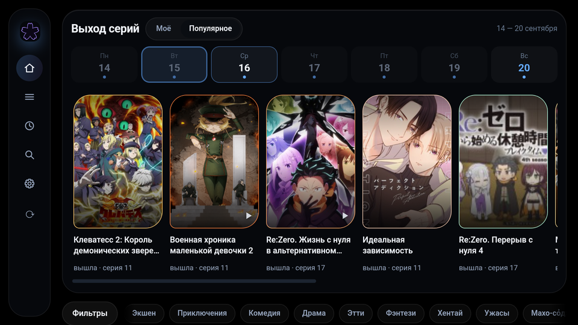
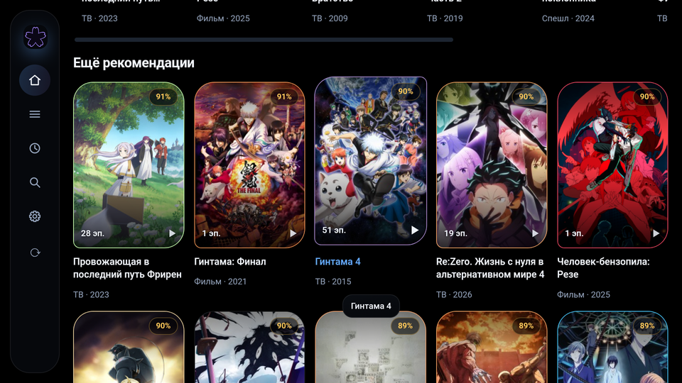
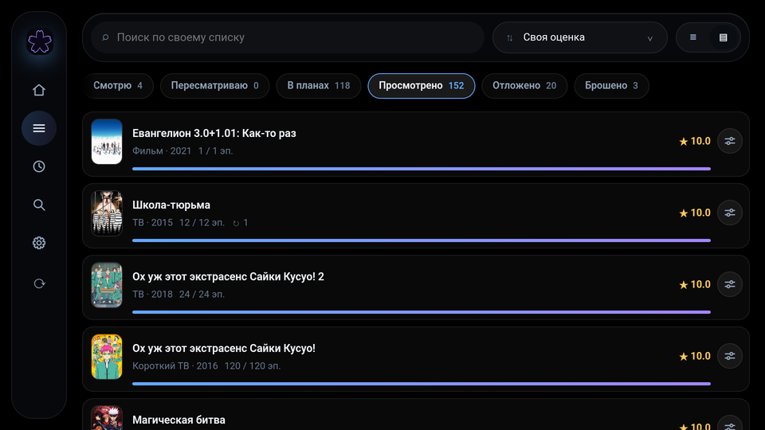
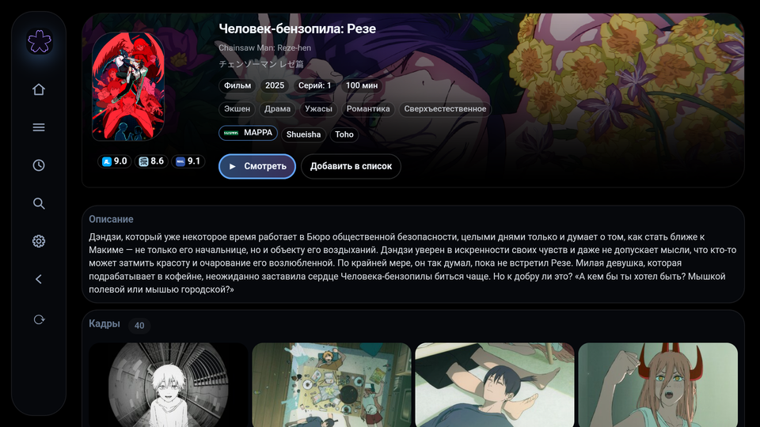

<div align="center">


# AniMori — приложение для AniList на Android TV

**Плеер, русские названия и списки AniList на приставке. Без рекламы, телеметрии и своих серверов.**

[](https://github.com/foulnike/Animori-TV/releases/latest)
[](https://github.com/foulnike/Animori-TV/releases/latest)
[](LICENSE)


[Установка](#установка) · [Что есть](#что-есть) · [Чего нет](#чего-нет) · [Сборка](#сборка) · [Документация](#документация)

</div>

---

**AniMori** — программа для Android TV, работающая с AniList напрямую. Проект
неофициальный и с командой AniList не связан.

> [!IMPORTANT]
> Рекламы, телеметрии и своих серверов нет. Токен, настройки и кэш лежат на устройстве.

> [!NOTE]
> У проекта три продукта. Этот репозиторий — приставка. Десктоп —
> `foulnike/AniMori-AniList-Toolkit`, юзерскрипт — `foulnike/Animori-Script`.

## Как выглядит

<p align="center">
  
  
  
  
</p>

Полные кадры 1920×1080 — [`screens/calendar.png`](screens/calendar.png),
[`screens/recs.png`](screens/recs.png), [`screens/lists.png`](screens/lists.png)
и [`screens/card.png`](screens/card.png).

## Установка

Файл — на [странице выпусков](https://github.com/foulnike/Animori-TV/releases/latest):
`AniMori_3.0.0_armv7.apk` для 32-разрядных приставок, `AniMori_3.0.0_arm64.apk`
для 64-разрядных. Разрядность — `adb shell getprop ro.product.cpu.abi`.

Ставится как обычное приложение: с флешки проводником или командой
`adb install`. Разрешение на установку из неизвестных источников Android
спрашивает один раз.

Следующие версии приложение находит само: при запуске спрашивает список
выпусков и показывает в меню **«Новая версия»**. Файл качается в кэш, ставит
его система.

Требования: Android TV, Android 7.0 и выше, пульт.

## Что есть

Разделы — **Главная**, **Моё**, **История**, **Поиск**, **Настройки**. Из них
открываются **Тайтл**, **Студия** и **Просмотр**.

- **Русский.** Интерфейс, названия и описания на русском. Источники — Shikimori,
  anime365, датасет имён.
- **Локальный снимок списка.** Работает без сети.
- **Ввоз и вывоз.** Ввоз с AniList, выгрузка в XML MyAnimeList, копия на
  Яндекс Диск — `docs/STORAGE.md`.
- **Плеер.** Отдельный экран. Источники — Aniliberty, Kodik — `docs/VIDEO.md`.
- **Страница тайтла.** Описание, персонажи, персонал, студии, кадры, трейлер,
  опенинги и эндинги.
- **Календарь выхода.** На главной: что и когда выйдет у того, что вы смотрите.
- **История.** Что смотрели, свежее вперёд.
- **Поиск.** По названиям, персонажам и персоналу.
- **Запросы из процесса.** Обращения к API идут из оболочки, а не из веб-части.
- **Вход в AniList.** В браузере устройства, токен остаётся на устройстве.
- **Пульт.** Фокус по стрелкам, рельс отдельной полосой — `docs/INTERFACE.md`.

## Чего нет

| Чего нет          |                                |
| :---------------- | :----------------------------- |
| Манга             | только аниме                   |
| Правки на AniList | сервер их не принимает         |
| Обновление без спроса | ставит человек             |
| Браузер наружу    | на приставке его нет           |
| Блокировщик рекламы | чужой кадр не используется   |

## Сборка

```bash
npm install
npm run build:app
npm run tauri -- android build -t armv7
```

Подпись и грабли инструментов — в `docs/BUILD.md`.

## Источники данных

| Источник                             | Назначение                                     |
| :----------------------------------- | :--------------------------------------------- |
| `graphql.anilist.co`                 | данные и списки                                |
| `shikimori.rip`, `shikimori.io`      | русские названия, описания, персонажи, франшизы |
| `smotret-anime.online`, `anime365.ru` | тайтлы и описания                             |
| `anilibria.top`, `kodik-api.com`     | ссылки на видео                                |
| `graphql.animethemes.moe`            | опенинги и эндинги                             |
| `cloud-api.yandex.net`               | копия списка, по нажатию                       |
| `github.com`                         | датасет русских названий                       |
| `api.github.com`                     | список выпусков                                |

## Документация

| Документ                                 | Вопрос                        |
| :--------------------------------------- | :---------------------------- |
| [`docs/ARCHITECTURE.md`](docs/ARCHITECTURE.md) | слои, ядро, мост, экраны |
| [`docs/INTERFACE.md`](docs/INTERFACE.md) | пульт, фокус, рельс, темы     |
| [`docs/DATA.md`](docs/DATA.md)           | источники, датасет, сеть, темп |
| [`docs/VIDEO.md`](docs/VIDEO.md)         | плеер и источники видео       |
| [`docs/STORAGE.md`](docs/STORAGE.md)     | что и где лежит               |
| [`docs/BUILD.md`](docs/BUILD.md)         | сборка APK                    |
| [`docs/CONVENTIONS.md`](docs/CONVENTIONS.md) | правила кода и документации |

Полный список — [`docs/README.md`](docs/README.md).

## Лицензия

[MIT](LICENSE) © foulnike. Лицензия покрывает код. Данные Shikimori и anime365
ею не покрываются: показываются со ссылкой на источник, в репозитории не
хранятся.

Датасет русских названий собирается в
[`foulnike/animori-data`](https://github.com/foulnike/animori-data) и выходит
под [CC0-1.0](https://creativecommons.org/publicdomain/zero/1.0/).

Сторонние сервисы принадлежат их владельцам и используются через публичные API.
